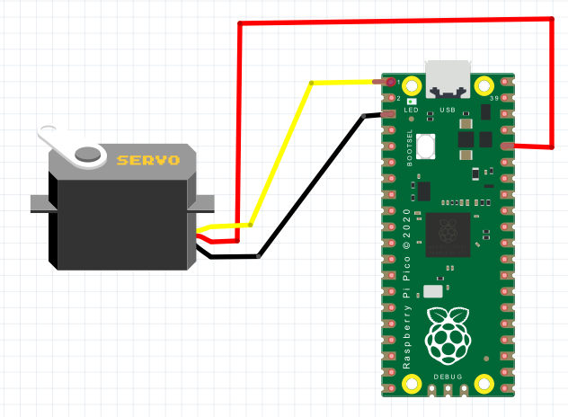

# Hướng dẫn điều khiển động cơ servo với pico:
- Để sử dụng servo trên raspberry pi pico thì bạn cần tạo một file thư viện để điều khiển servo.
- Bạn hãy lưu file này với tên "servo.py" trong bộ nhớ của raspberry pi pico.
- Sau đó dùng file "controlServo180.py" để điều khiển động cơ servo. 
- Nếu bạn muốn chương trình tự chạy khi khởi động pico thì hãy đổi tên  file "controlServo180.py" thành "main.py".
# Instructions for controlling servo motors with pico:
- To use servo on raspberry pi pico, you need to create a library file to control the servo.
- Please save this file with the name "servo.py" in the memory of your raspberry pi pico.
- Then use the file "controlServo180.py" to control the servo motor.
- If you want the program to run automatically when starting pico, rename the file "controlServo180.py" to "main.py".
# Kết nối pico với servo:
- Chú ý nhớ sửa đổi chân điều khiển servo trong chương trình đúng với chân thực tế đã kết nối với servo.
- Trong chương trình này chân pico được dùng để kết nối với servo là chân 2
<picture>
  
</picture>

# Connect pico to servo:
- Remember to modify the servo control pin in the program to match the actual pin connected to the servo.
- In this program, the pico pin used to connect to the servo is pin 2

<head>
<meta name="google-site-verification" content="bg6OmePvf78FBOSnBCvpfZ-Ic2MgpxoFf-uglRrDpg8" />
</head>
